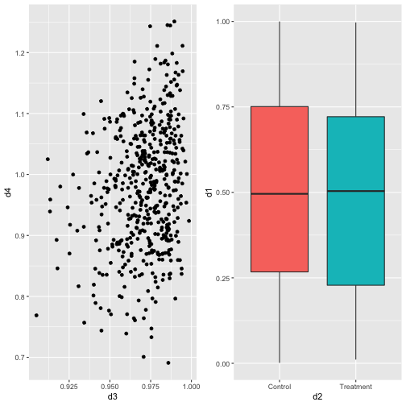
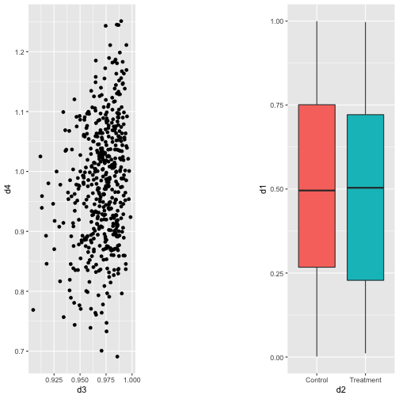
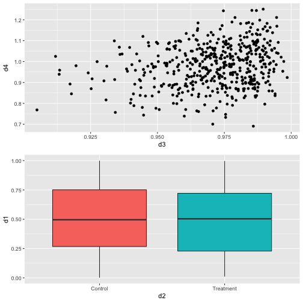
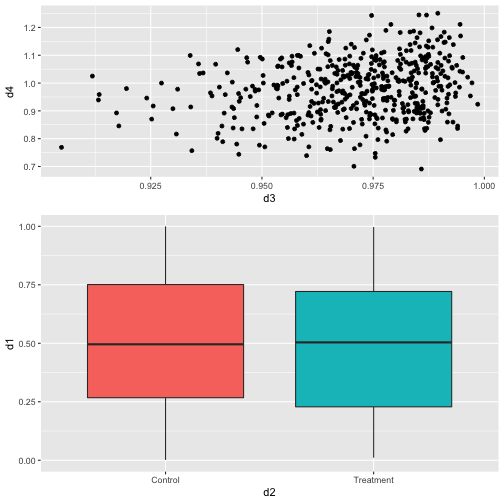
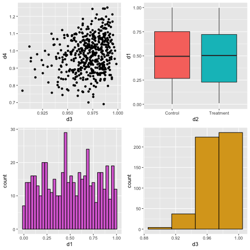
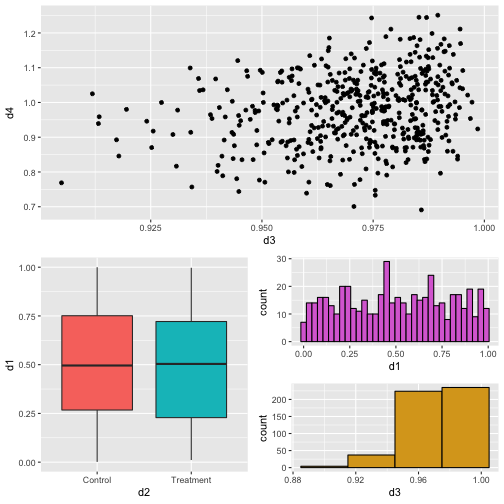
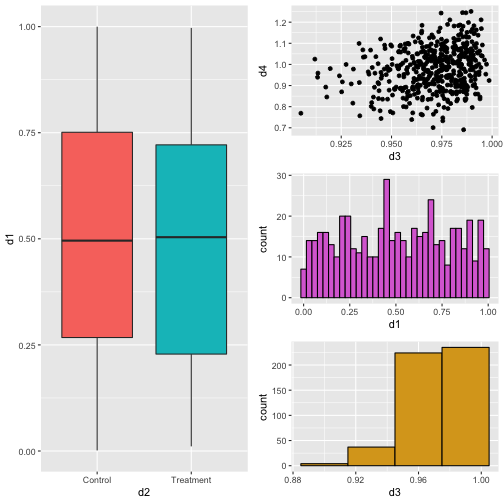

## Arrange plots with patchwork

First generate 4 different plots


```r
library(ggplot2)
library(patchwork)


d1 <- runif(500)
d2 <- rep(c("Treatment", "Control"), each = 250)
d3 <- rbeta(500, shape1 = 100, shape2 = 3)
d4 <- d3 + rnorm(500, mean = 0, sd = 0.1)
plotData <- data.frame(d1, d2, d3, d4)

p1 <- ggplot(data = plotData) + geom_point(aes(x = d3, y = d4))
p2 <- ggplot(data = plotData) + geom_boxplot(aes(x = d2, y = d1, fill =
                                                   d2)) +
  theme(legend.position = "none")
p3 <- ggplot(data = plotData) +
  geom_histogram(aes(
    x = d1,
    color = I("black"),
    fill = I("orchid")
  ), binwidth = 0.03)
p4 <- ggplot(data = plotData) +
  geom_histogram(aes(
    x = d3,
    color = I("black"),
    fill = I("goldenrod")
  ), binwidth = 0.03)  
```

## Side by side

Just use `+` and add plts side by side


```r
# side by side
p1 + p2
```



## Space them out

You can also add a spacer with `plot_spacer` to space out plots


```r

# side by side with space

p1 + plot_spacer() + p2
```



# Vertical plots

It's easy to vertically separate with a `/`


```r


# vertical

p1 / p2
```


# Use `plot_layout` to specify number of columns


```r
# or 

p1 + p2 + plot_layout(ncol = 1)
```




```r
# Resize heights

p1 + p2 + plot_layout(ncol = 1, heights = c(2, 3))
```




```r
# two on top, two on bottom

(p1 + p2) / (p3 + p4)
```




```r
# Complex layouts

p1 + (
  p2 + ( p3 + p4 + plot_layout(ncol = 1))
) + plot_layout(ncol = 1)
```



# Can you make this?




